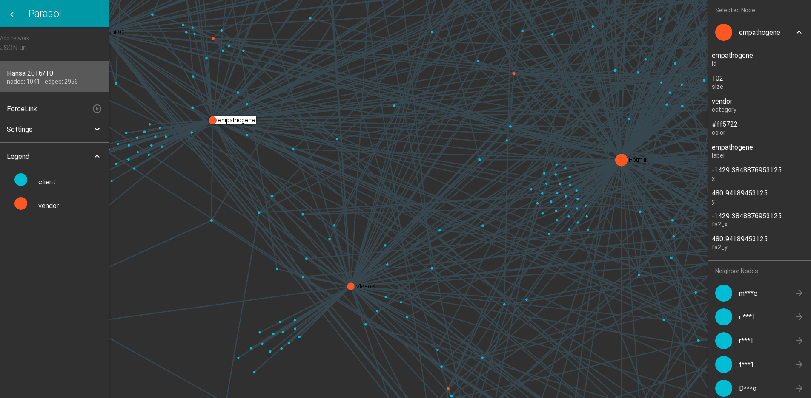

parasol
=======

A network graph exploration tool

## Screenshots

 

## Run

```
npm install
npm start
open http://localhost:8095
```

## settings.json - global app config

When opening the project webpage, it loads `settings.json` file that contains
specific settings for network to pre-load and general user interface.

```
{
  "networks": [
    {
      "url": "json/tsne.json",
      "name": "TSNE",
      "options": {
        "relativeSize": true
      }
    },
    ...
  ],
  "ui": {
    "muiTheme": "dark"
  }
}
```

* `networks` array : list of networks to pre-load inside parasol
* `network` object :
  * `url` : url of the file containing the network graph
  * `name` : name of the network to display in parasol UI
  * `options` object : various plugins to load for this specific network
    * `relativeSize` : sets nodes sizes corresponding its degree
    * `randomizeNodePosition` : sets random positions to all nodes
    * `startForce` : run ForceAtlas2 layout once the graph is loaded, allows to move randomized nodes to its nearest neighbor
* `ui` object :
  * `muiTheme` : general theme setting, can be `light` or `dark`

## networks.json - list of available networks

If you want to have pre-defined networks available, you can fill the file `networks.json`.

This file will be fetched, and its networks will be available in the **Add Network** modal.

This feature can help you if you don't want to load in the left drawer this list of secondary networks.

## Deploy on a webserver

### Build and deploy

```
yarn install
yarn build
scp -r build/* webserver:/var/www/parasol/
```

Don't forget to set your default settings in `build/settings.json`, move your data in `build/data/` folder, and set available networks inside `build/networks.json`.

### nginx configuration

You need an `api` location to use deepdetect loader.

Configuration example for http://parasol.deepdetect.com :

```
server {
  listen 80;
  listen [::]:80;

  root /var/www/parasol;
  index index.html index.htm;

  server_name parasol.deepdetect.com;

  location / {
    try_files $uri $uri/ =404;
    autoindex on;
  }

  location /api {
    rewrite ^/api(.*)$  $1  break;
    # DeepDetect server
    proxy_pass         http://server_ip:server_port;
    proxy_set_header   Host                   $http_host;
    # If you have http basic auth in place on your deepdetect server
    # Get base_64_from terminal: echo -n 'login:pass' | base64
    # proxy_set_header Authorization "Basic base_64_string";
    proxy_set_header X-Real-IP $remote_addr;
    proxy_set_header X-Forwarded-For $proxy_add_x_forwarded_for;
    proxy_redirect off;
  }
}
```


## Credits

* [sigma](http://sigmajs.org/) for the visualisation tool
* [react-sigma](https://dunnock.github.io/react-sigma/) for connecting sigma to react
* [mobx-react-boilerplate](https://github.com/il-tmfv/mobx-react-boilerplate) for providing a boilerplate
* [deepdetect](https://deepdetect.com) for machine learning integration
* [deepdetect-js](https://github.com/alx/deepdetect/tree/client-js-242/clients/js) client library to connect to deepdetect server
