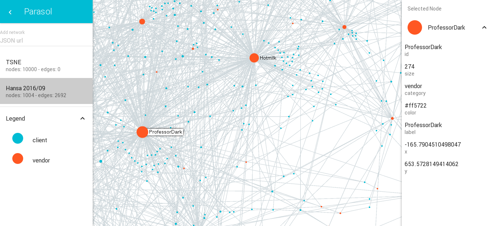
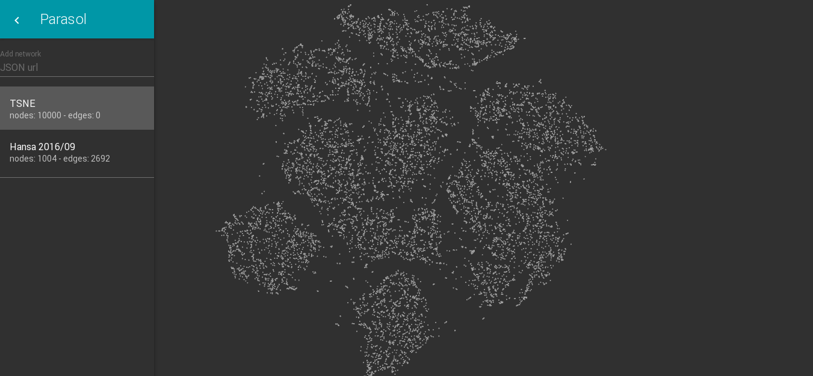

 
 
 
 

parasol
=======

A network graph exploration tool

### Run

```
npm install
npm start
open http://localhost:8095
```

### settings.json

When opening the project webpage, it loads `settings.json` file that contains
specific settings for network to pre-load and general user interface.

```
{
  "networks": [
    {
      "url": "json/tsne.json",
      "name": "TSNE",
      "options": {
        "relativeSize": true
      }
    },
    ...
  ],
  "ui": {
    "muiTheme": "dark"
  }
}
```

* `networks` array : list of networks to pre-load inside parasol
* `network` object :
  * `url` : url of the file containing the network graph
  * `name` : name of the network to display in parasol UI
  * `options` object : various plugins to load for this specific network
    * `relativeSize` : sets nodes sizes corresponding its degree
    * `randomizeNodePosition` : sets random positions to all nodes
    * `startForce` : run ForceAtlas2 layout once the graph is loaded, allows to move randomized nodes to its nearest neighbor
* `ui` object :
  * `muiTheme` : general theme setting, can be `light` or `dark`


### Credits

* [sigma](http://sigmajs.org/) for the visualisation tool
* [react-sigma](https://dunnock.github.io/react-sigma/) for connecting sigma to react
* [mobx-react-boilerplate](https://github.com/il-tmfv/mobx-react-boilerplate) for providing a boilerplate
